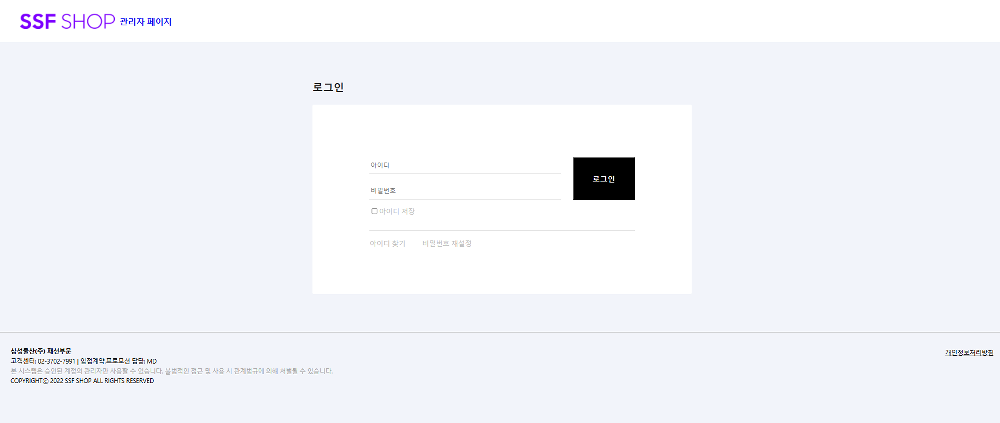
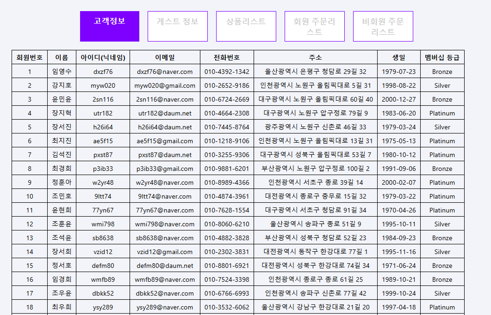
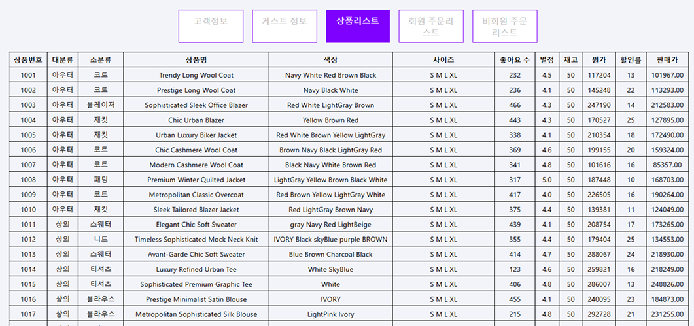
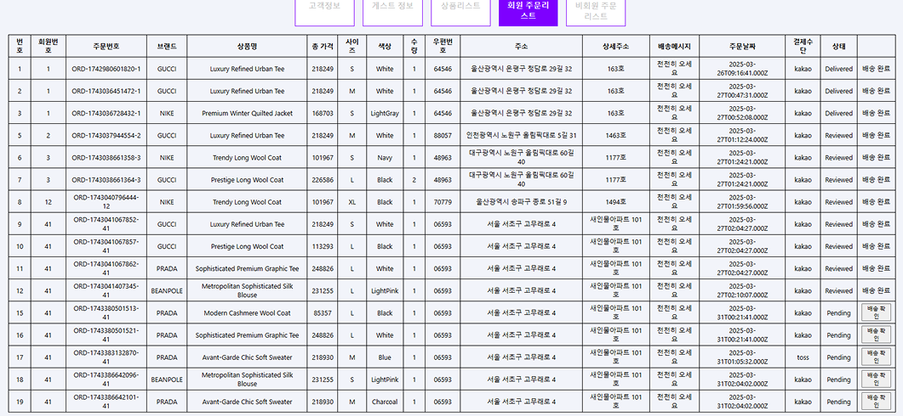
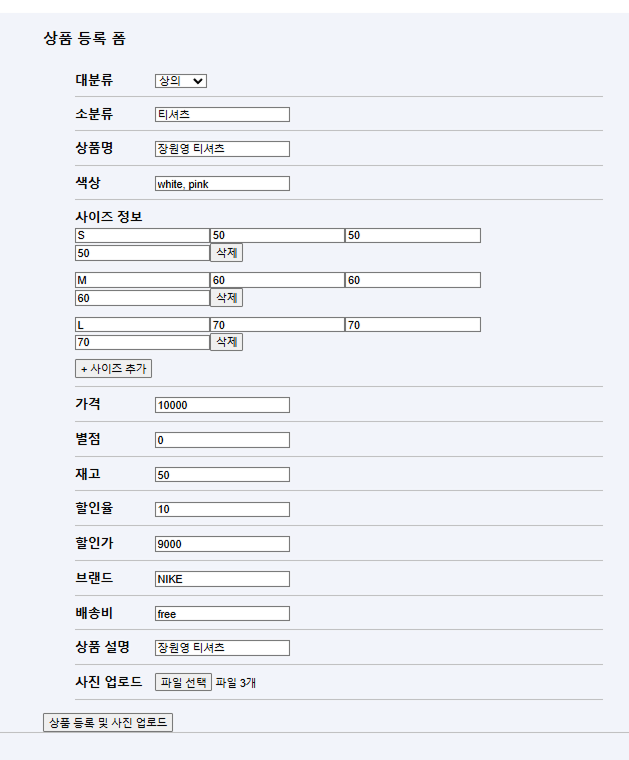

# ssfAdmin

# 🛠️ SSF 쇼핑몰 관리자 페이지

SSF 쇼핑몰의 관리자 전용 웹 애플리케이션입니다.  
관리자는 상품 및 고객 데이터, 주문 내역을 관리하고  
WebSocket을 활용해 상품 등록, 회원 생성, 배송 상태 등의 정보를 고객 페이지와 연동할 수 있습니다.

> 이 프로젝트는 `React` 기반의 관리자 전용 프론트엔드 애플리케이션입니다.

---

## 🖥️ 프로젝트 소개

고객 페이지와 연동되는 관리자 페이지로,  
**쇼핑몰 운영을 위한 실시간 상품/주문/회원 관리**를 목표로 제작되었습니다.

## 🕰️ 개발 기간

2025-02-17 ~ 2025-03-14

---

## ✒️ 프로젝트 목표

1. 관리자 페이지의 전반적인 기능 흐름 이해 및 구현  
2. 실시간 데이터 관리 (상품 등록, 배송 상태, 회원 정보 등) 구현  
3. WebSocket을 활용한 양방향 데이터 처리 경험  
4. 상품 및 주문 관리 UI를 효율적으로 구성하고 API 통신 연동

---

## 📌 주요 기능

### 🔐 관리자 인증
- JWT 기반 로그인
- 인증 토큰 발급 및 localStorage 저장

### 🛒 상품 관리
- 전체 상품 목록 조회
- 상품 등록 / 목록 조회
- 실시간 등록 시 고객 페이지에 자동 반영 (WebSocket)

### 👤 고객 및 비회원 관리
- 회원 리스트 조회 및 상세 정보 확인
- **비회원 주문자 정보도 포함하여 주문 관리**
- 신규 회원 생성 시 → 실시간 고객 페이지 반영

### 📦 주문 내역 및 배송 관리
- 전체 주문 내역 확인
- 배송 상태 확인 및 상태 변경
- "배송 확인" 버튼 클릭 시 → 고객 페이지에 WebSocket으로 실시간 전송  
  → 고객이 마이페이지에서 배송 완료 확인 및 리뷰 작성 가능

---

## 📡 WebSocket 연동 기능

- 상품 등록 → 고객 페이지에 실시간 반영  
- 회원 가입 → 관리자 페이지에서 실시간 확인  
- 배송 상태 변경 → 고객 페이지 마이페이지에 실시간 알림  
- 리뷰 버튼 노출 트리거 등 양방향 상호작용 가능

---

## 🧑‍💻 기술 스택

- **Frontend**: React, React Router
- **상태 관리**: Context API
- **API 통신**: Axios
- **실시간 통신**: WebSocket
- **스타일링**: CSS
- **배포**: AWS

---

## 📸 화면 구성 예시

(이미지 캡처 파일 경로가 `./assets/`에 있을 경우)

### 🔐 로그인


### 📋 회원 관리


### 📦 상품 관리


### 📋 주문 및 배송 관리


### 📋 상품 등록


---
## http://ssf-client.s3-website.ap-northeast-2.amazonaws.com/ 고객페이지 배포 주소
## http://ssf-admin-client.s3-website.ap-northeast-2.amazonaws.com/ 관리자 페이지 배포 주소

관리자 -> 고객페이지 순으로 열어야 함.

## 🚀 실행 방법

```bash
npm install
npm start


